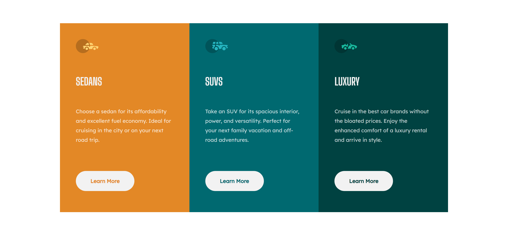

# Frontend Mentor - 3-column preview card component solution

This is a solution to the [3-column preview card component challenge on Frontend Mentor](https://www.frontendmentor.io/challenges/3column-preview-card-component-pH92eAR2-). Frontend Mentor challenges help you improve your coding skills by building realistic projects. 

## Table of contents

- [Overview](#overview)
  - [The challenge](#the-challenge)
  - [Screenshot](#screenshot)
  - [Links](#links)
- [My process](#my-process)
  - [Built with](#built-with)
  - [What I learned](#what-i-learned)
  - [Continued development](#continued-development)
- [Author](#author)

## Overview
This challlenge is for beginners practicing CSS but i decided to use it instesd to practice SAAS
### The challenge

Users should be able to:

- View the optimal layout depending on their device's screen size
- See hover states for interactive elements

### Screenshot

### Links

- Solution URL: [Add solution URL here](https://your-solution-url.com)
- Live Site URL: [Add live site URL here](https://your-live-site-url.com)

## My process

### Built with

- Semantic HTML5 markup
- CSS custom properties
- Flexbox
- CSS Grid
- Mobile-first workflow
- SASS/SCSS
- [Styled Components](https://styled-components.com/) - For styles

### What I learned

My reason for taking up thid challange isn't really to learn something new, it is to be more fluid with the use of SASS and i can confidently say that i got better with the use of SASS and even grid in CSS

### Continued development
My next project will be  more focused on the integration of Js into my development

## Author

- Website - [Chemben](https://www.your-site.com)
- Frontend Mentor - [@chemben17](https://www.frontendmentor.io/profile/yourusername)
- Twitter - [@chemben2](https://www.twitter.com/yourusername)
